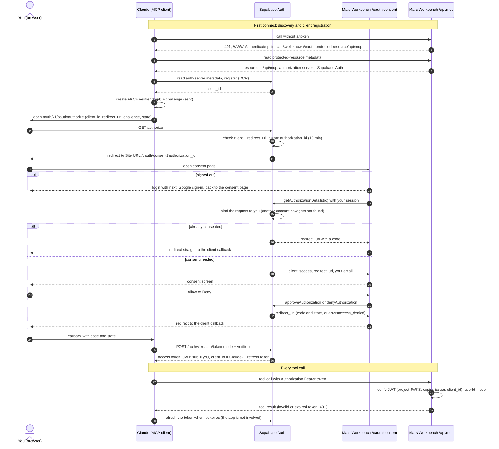

# Auth Flows

Flows for authentication (`/auth/*`, `/oauth/consent`, `/api/mcp` tokens) — route protection, Google OAuth sign-in/up, MCP connector consent and token checks, and sign-out. Sibling docs: `design/flows/board.md`, `design/flows/plan.md`, `design/flows/priorities.md`, `design/flows/shared.md`.

## Route Protection Flow

**Trigger:** User navigates to any protected route without a valid session

**Mechanism:** The Next.js proxy (`src/proxy.ts`, delegating to `updateSession` in `src/lib/supabase/middleware.ts`) checks the session. If no valid session exists, redirect to `/auth/login?next=<requested path + query>` (no `next` for `/`), so sign-in returns the visitor to the page that asked for it.

## Login Flow

**Trigger:** User navigates to `/auth/login`

**Steps:**

1. User clicks "Sign in with Google"; the login page hands `next` to the callback in a short-lived cookie scoped to `/auth/callback`
2. Browser redirects to Google OAuth consent screen; user completes authentication
3. Google redirects to the Supabase callback URI for token exchange
4. Supabase redirects to `/auth/callback` with an authorization code
5. The app exchanges the code for a session via `supabase.auth.exchangeCodeForSession()`
6. User is redirected to `next`, or the homepage without one; a failed exchange returns to the login page, still carrying `next`

Rules: `redirectTo` stays the bare `/auth/callback` — Supabase matches it against the Redirect URLs allow-list query included, so a `next` query would fall back to the Site URL. The callback clears the cookie, and a plain sign-in expires any stale one. `next` is honored only as a same-origin path (`getSafeNextPath` resolves it and rejects anything another origin could hide behind — `//host`, `/\host`, control characters); otherwise it falls back to `/`. An already signed-in visitor on `/auth/login` is forwarded to `next` the same way.

## Sign-Up Flow

Same as login — Supabase auto-creates a user record on first Google sign-in.

## OAuth Consent Flow

**Trigger:** An MCP client (Claude) starts Supabase's OAuth 2.1 authorization flow; Supabase redirects to the app's authorization path, `/oauth/consent?authorization_id=…` (Site URL + the path set under Authentication → OAuth Server)

Two OAuth flows meet here: Supabase is the **authorization server** for Claude (it issues the authorization id, the code and the token), while signing in to the app itself is the separate Google flow above. The app hosts the consent screen for Supabase and, as `/api/mcp`, is the resource server that checks the token.

**Steps (the consent page):**

1. Signed out → Route Protection sends the user through login and back here (`next`)
2. The page loads the request (`getAuthorizationDetails`):
   - consent needed → the consent screen: client, approving account, what access it grants, the host the browser returns to, Deny / Allow
   - already consented → redirect straight back to the client (no UI)
   - missing, malformed, unknown, expired or already decided → the invalid-link state
3. Allow / Deny → `approveAuthorization` / `denyAuthorization` → redirect to the returned `redirect_url` (the code, or `error=access_denied`). A request that can no longer be decided re-renders the page into the invalid-link state

Rules: Supabase binds a request to the first account that opens it (another account gets not-found) and expires it after 10 minutes, so there is no in-page account switch — the wrong account starts over from the client. The page is chromeless and never renders inside a frame (`frame-ancestors 'none'` + `X-Frame-Options: DENY` on `/oauth/*`, against clickjacking the Allow button). The access list is fixed copy — a token reaches every MCP tool whatever the scopes; the raw scopes are shown muted. The return host comes from the client's redirect URI (client names are self-asserted under dynamic registration). `authorization_id` must match Supabase's alphanumeric format before any call — the SDK puts it in its API path unescaped. Requires the OAuth Server enabled in the Supabase dashboard with this authorization path, plus dynamic client registration (Claude registers itself).

**Token rules (`/api/mcp`):** every request needs a Supabase access token signed with the project's key (checked against its JWKS, cached, no Auth round trip), unexpired, issued by `<project>/auth/v1`, and carrying `client_id`, which only OAuth-server tokens have, so the browser session's own token is refused. Supabase doesn't bind tokens to a resource (`aud` is always `authenticated`), so any OAuth client the user approved in this project can call the endpoint; scopes aren't checked. Revoking a grant stops refreshes, but an access token already issued stays valid until it expires (the JWT expiry, 1 h by default). Missing or invalid → 401 with the metadata pointer, which also sends the client to refresh or re-authorize. Local development without a token acts as `MCP_DEV_USER_ID`.

## Theme Change Flow

> The Settings overlay itself (entry points, sheet/modal presentation, panel
> layout) is UI, not a flow — see the auth scenario (`/design/scenarios/auth`).
> Flows below cover only its side-effecting actions. `/kanban/settings` no longer
> exists — settings is overlay-only on both breakpoints.

**Trigger:** User selects a theme card in the Settings overlay — Sora light (`mars-light`) / Sora dark (`mars-dark`) / P5 dark (`p5-dark`, per the Calling Card proposal)

**Steps:**

1. Client stamps `data-theme` on `<html>` immediately (optimistic, no reload)
2. `updateThemeAction` persists the choice in an SSR-readable cookie; `layout.tsx` reads it so the next server render ships the right theme (no flash)
3. The selected card shows its check ring; re-selecting is a no-op

Rules: default with no cookie is `mars-dark` (first-time users); theme is an explicit user choice — no time- or system-preference auto-switching. Internal theme names are stable (`mars-*`, `p5-dark`); display labels live in i18n. `<html>` is the only theme scope on a page: the Design Console previews by re-stamping it and restores the cookie theme on exit, never writing the cookie.

## Sign-Out Flow

**Trigger:** User confirms the two-step sign-out row in the Settings overlay (the arm/confirm interaction itself is UI — see the auth scenario)

**Steps:**

1. Call `supabase.auth.signOut()` to end the session
2. Redirect to `/auth/login`
